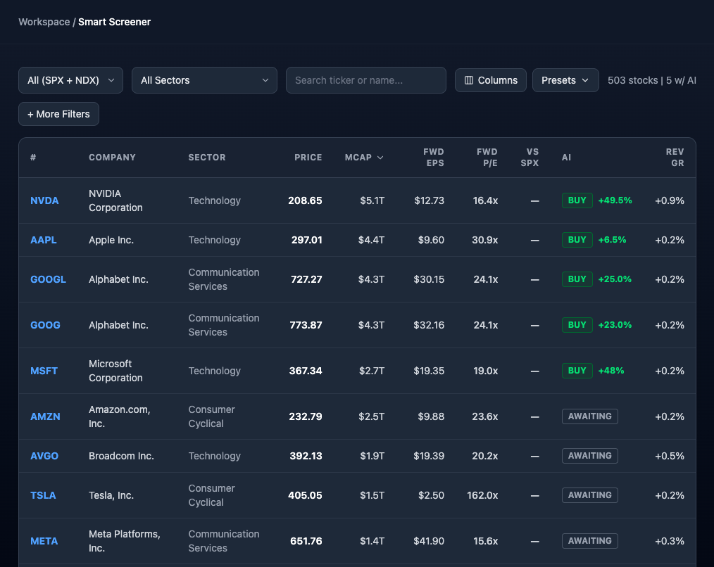
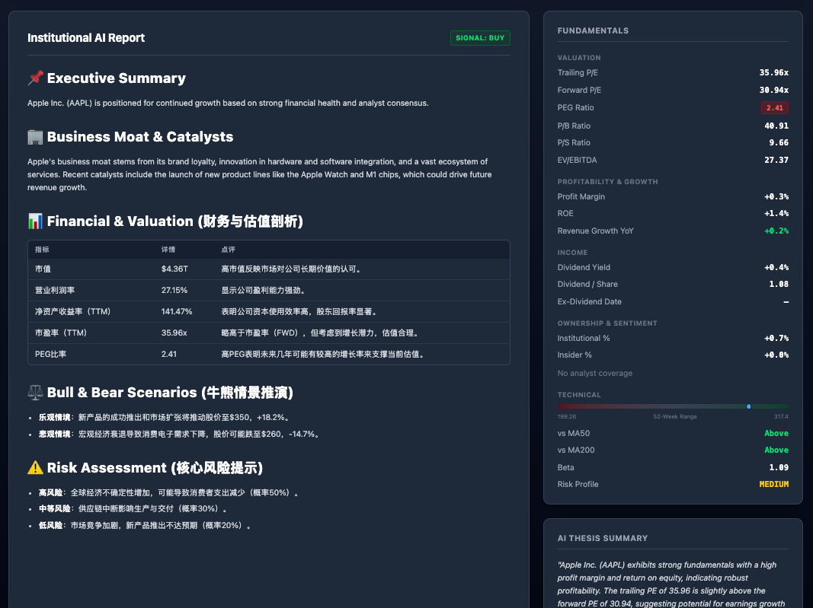
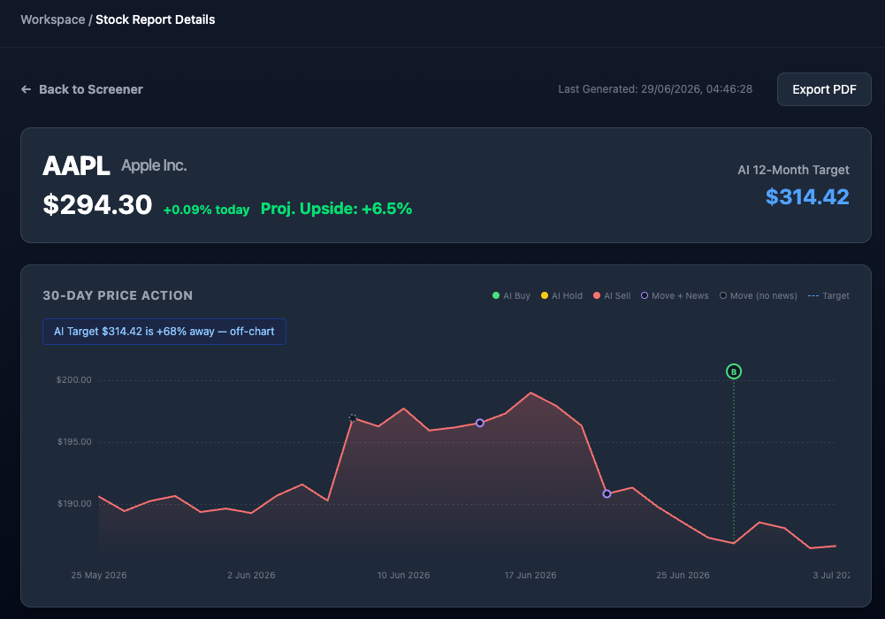
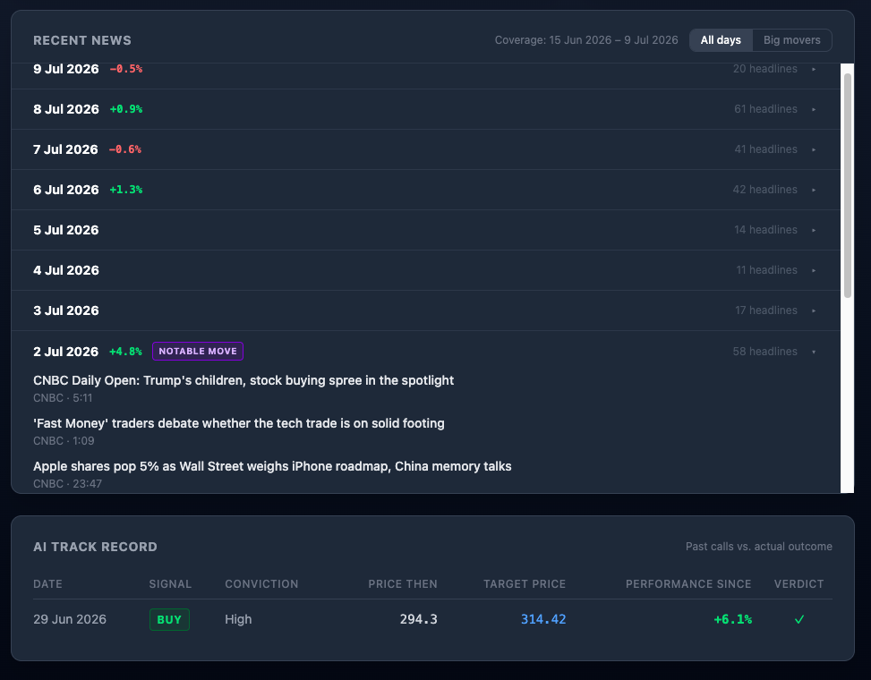
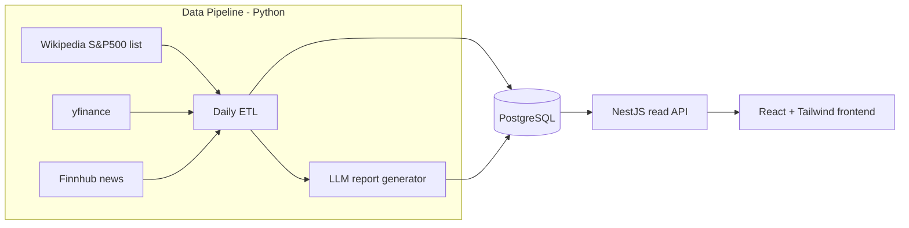

# SignalLedger — Verifiable AI Equity Research

> Open-source equity research platform that records every AI investment call
> and measures it against what the market actually did. Includes a daily data
> pipeline, explainable LLM reports, and an interactive stock screener.

## Screenshots

### Screener



### Stock detail







## Features

- **Multi-factor screener** — filter ~500 S&P constituents by valuation
  (fwd P/E vs SPX), growth, quality, income, and technicals, with saved presets
- **AI investment reports** — LLM-generated institutional-style reports
  (BUY/HOLD/SELL, target price, conviction, risk level), archived with the
  price at generation time
- **Verifiable AI track record** — every historical call is plotted against
  what the price actually did afterwards
- **Story-telling price chart** — 30-day chart overlaying AI signals, target
  price, and "notable move" markers (±2% day or 2× volume) linked to that
  day's news
- **News intelligence** — per-ticker news archive (Finnhub), deduplicated and
  ranked by source quality

## Architecture



**Design principle:** Python owns all writes and the schema; the Node API is
a read-only gateway; the frontend only talks to the API. Shared TypeScript
types (`api-types`) are the contract between all layers.

| Package                                          | Role                             | Stack                                |
| ------------------------------------------------ | -------------------------------- | ------------------------------------ |
| `[packages/data-python](packages/data-python)`   | ETL, news ingestion, LLM reports | Python, yfinance, Finnhub, LangChain |
| `[packages/backend-node](packages/backend-node)` | Read-only REST API               | NestJS, TypeORM                      |
| `[packages/frontend-web](packages/frontend-web)` | Screener + stock detail UI       | React, Vite, Tailwind                |
| `[packages/api-types](packages/api-types)`       | Shared type contract             | TypeScript                           |

## Quick Start

**Prerequisites:** Node 20+, pnpm 8+, Python 3.11+, Docker

```bash
# 1. Install dependencies
pnpm install

# 2. Start PostgreSQL (maps host port 5433 → container 5432)
docker compose up -d

# 3. Configure the Python data pipeline
cp packages/data-python/.env.example packages/data-python/.env
# Edit .env — at minimum: DB_PASSWORD, CF_NAMESPACE_ID, CF_API_TOKEN
# Optional: FINNHUB_API_KEY (news), OPENAI_API_KEY / DEEPSEEK_API_KEY (AI reports)

# 4. Run the data pipeline (prices, fundamentals, news)
cd packages/data-python
pip install -r requirements.txt
python scripts/daily_etl_pipeline.py

# Optional: generate AI reports (smart=GPT-4o, normal=DeepSeek, local=Ollama)
python main.py --tickers AAPL NVDA --tier normal

# 5. Start the app (two terminals)
cd packages/backend-node && pnpm start:dev   # http://localhost:4000
cd packages/frontend-web && pnpm dev         # http://localhost:5173
```

The ETL also runs on a weekday schedule via GitHub Actions
([`.github/workflows/etl.yml`](.github/workflows/etl.yml)).

## Deployment

| Component | What it is | Where to run |
| --- | --- | --- |
| **Python ETL + reports** | Scheduled batch jobs (not a web server) | **GitHub Actions** (already wired) or cron on a VPS |
| **PostgreSQL** | Shared database | **Supabase**, Neon, Railway Postgres, or Docker on a VPS |
| **backend-node** | Read-only REST API | **Railway**, Render, Fly.io, or a VPS (`pnpm build && pnpm start:prod`) |
| **frontend-web** | Static SPA after `pnpm build` | **Vercel**, Netlify, or Cloudflare Pages |

Typical layout:

```
GitHub Actions (cron) ──► Python ETL ──► Supabase Postgres
                                              ▲
Railway / Render ──► NestJS API ──────────────┘
Vercel ──► React static site ──► calls public API URL
```

Before going live:

- Copy each package's `.env.example` to `.env` and set production values
  (`DB_*` for backend-node, `VITE_API_BASE` for frontend-web, API keys for data-python)
- Store secrets in your host or GitHub Actions Secrets — never commit `.env`

See `.env.example` in each package for required variables.

## Roadmap

**Vision:** a self-hosted equity research workbench with a real UI — browse AI
reports from earliest to latest, plug in your own LLM, and define how analysis
is done. Compare strategies and models via a verifiable track record.

### Next up

- [ ] **IPO analysis module** — user-driven prospectus analysis for any market
      (not auto-discovery). IPO discovery is left to the user: there is no
      reliable global IPO calendar API, and each exchange (Bursa Malaysia, HKEX,
      SGX, ASX, NYSE/NASDAQ, etc.) has its own disclosure system. The module
      focuses on **analysis**, not discovery.

      **Input flow**
      1. User provides company name/ticker + exchange (sets currency and optional
         post-listing price lookup).
      2. User uploads the official prospectus (PDF — S-1, Bursa prospectus,
         SGX offer document, etc.; any language).
      3. System parses the document, extracts key sections (business overview,
         financials, risk factors, use of proceeds, cap table / lock-up), and
         feeds them to a dedicated IPO agent.
      4. Agent outputs a structured report (same archive + UI pattern as existing
         equity reports, but IPO-specific fields — e.g. SUBSCRIBE / AVOID / WATCH,
         valuation vs. comps, red flags, lock-up — not BUY/HOLD/SELL target-price
         logic for pre-IPO names).
      5. *Optional:* if the stock is already listed and yfinance recognizes the
         ticker suffix (e.g. `.KL`, `.HK`, `.SI`), attach a simple post-IPO price
         chart — passive lookup only, no IPO calendar scraping.

      **Scope**
      - New `ipo_analyst` agent + IPO report schema in `packages/data-python`
      - CLI-first MVP (`ticker`, `exchange`, `--prospectus path/to.pdf`) reusing
        existing report persistence; web upload can follow later
      - US SEC EDGAR auto-fetch is a *convenience* for US users only, not a core
        dependency — the upload path must work standalone worldwide

### Planned

- [ ] **Report timeline UI** — per-ticker history from first report to latest;
      click any past report to read it alongside price-at-generation vs. today
- [ ] **Bring your own LLM** — configure provider, API key, and model
      (OpenAI / DeepSeek / Ollama / OpenAI-compatible base URL) without code changes
- [ ] **Pluggable analysis strategies** — YAML/Markdown presets for analyst
      persona, focus factors, and prompt templates (e.g. value vs. growth vs.
      news-first); same output schema, different reasoning style
- [ ] **Recent Catalysts in reports** — feed archived `stock_news` into report
      generation so AI conclusions reference actual headlines
- [ ] **One-command local setup** — `docker compose` for Postgres + API +
      frontend, plus seed data so new users can explore the UI without API keys

### Exploring

- [ ] **AI track-record backtesting page** — compare BUY/HOLD/SELL calls vs.
      actual forward returns (30d / 90d) across models and strategies
- [ ] **LLM one-line summaries for notable-move days** — replace raw headline
      lists on chart markers with a single "what happened that day" sentence
- [ ] **Multi-step analysis workflows** — optional bull/bear debate or
      news-then-fundamentals pipeline (lightweight take on agent frameworks)
- [ ] **External agent hook** — call a user-provided webhook or Python plugin
      and ingest structured results into the same report archive + UI
- [ ] **Candlestick chart with longer lookback** — zoom/pan for 6–12 month views

### Non-goals

- Real-time trading or order execution
- Licensed/delay-free market data feeds
- Financial advice or regulated investment products

## Disclaimer

This is a research and educational tool. Nothing here is financial advice.
Market data comes from unofficial/free APIs (yfinance, Finnhub free tier)
and may be delayed or inaccurate. Do not commit API keys or `.env` files.

## License

MIT
