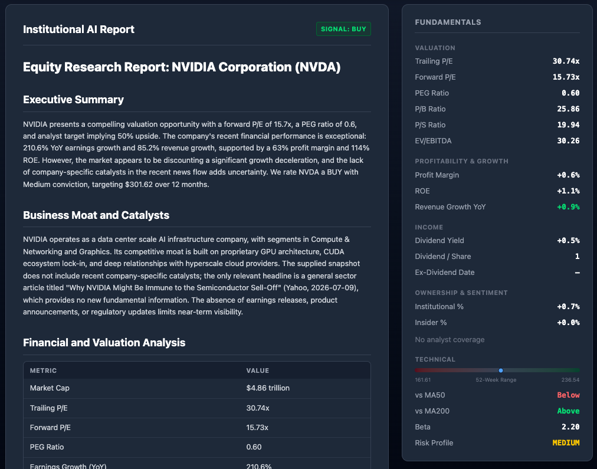
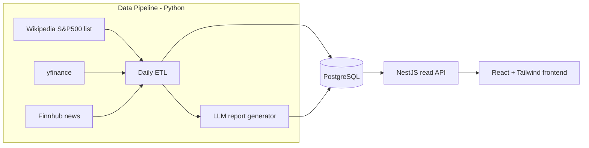

# SignalLedger — Verifiable AI Equity Research

[](https://github.com/YenHSee/signal-ledger/actions/workflows/ci.yml)

> Open-source equity research platform that records every AI investment call
> and measures it against what the market actually did. Includes a daily data
> pipeline, explainable LLM reports, and an interactive stock screener.

## Project status

SignalLedger is currently available as a public preview. A local no-key Docker
demo includes frozen 2026 YTD market data, news, and historical AI reports. The
live pipeline remains available for developers who provide their own data and
model credentials.

## Screenshots

### Screener


### Stock detail




## Features

- **Multi-factor screener** — filter ~500 S&P constituents by valuation
  (fwd P/E vs SPX), growth, quality, income, and technicals, with saved presets
- **AI investment reports** — LLM-generated institutional-style reports
  (BUY/HOLD/SELL, target price, conviction, risk level), archived with the
  price at generation time
- **Verifiable AI track record** — every historical call is plotted against
  what the price actually did afterwards
- **Story-telling price chart** — historical chart overlaying AI signals, target
  price, and "notable move" markers (±2% day or 2× volume) linked to that
  day's news
- **News intelligence** — per-ticker news archive (Finnhub), deduplicated and
  ranked by source quality

## Architecture



**Design principle:** Python owns all writes and the schema; the Node API is
a read-only gateway; the frontend only talks to the API. Shared TypeScript
types (`api-types`) are the contract between all layers.

| Package                                          | Role                             | Stack                                |
| ------------------------------------------------ | -------------------------------- | ------------------------------------ |
| [`packages/data-python`](packages/data-python)   | ETL, news ingestion, LLM reports | Python, yfinance, Finnhub, LangChain |
| [`packages/backend-node`](packages/backend-node) | Read-only REST API               | NestJS, TypeORM                      |
| [`packages/frontend-web`](packages/frontend-web) | Screener + stock detail UI       | React, Vite, Tailwind                |
| [`packages/api-types`](packages/api-types)       | Shared type contract             | TypeScript                           |

## Quick Start

### No-key sample demo

You need Git and Docker Desktop (or Docker Engine with Compose v2). Node.js,
Python, pnpm, provider accounts, and API keys are not required.

Install and start:

```bash
git clone https://github.com/YenHSee/signal-ledger.git
cd signal-ledger
docker compose --profile demo up --build
```

The first build downloads the base images and installs dependencies, so it can
take a few minutes. Wait until the terminal prints:

```text
SignalLedger demo is starting:
  http://127.0.0.1:8080/stock/screener
```

Open <http://127.0.0.1:8080/stock/screener>. Compose waits for PostgreSQL,
loads the frozen fixture, and starts the sample API and frontend in the correct
order. The command remains attached because the application is running; this
is expected. Press `Ctrl+C` to stop it, or start it in the background with:

```bash
docker compose --profile demo up --build -d
```

Check the running services and sample metadata:

```bash
docker compose --profile demo ps
curl http://127.0.0.1:8080/api/meta
```

Stop the demo without deleting its database volume:

```bash
docker compose --profile demo down
```

The sample PostgreSQL database is exposed on `127.0.0.1:5434` for optional
inspection (`postgres` / `password123`, database `signal_ledger_sample`). Ports
`8080` and `5434` must be available.

The demo does not call Finnhub, Yahoo Finance, SEC, or an LLM while starting.
The current fixture remains marked as a draft while redistribution review is
pending; the demo profile enables it only for local review. See the
[Third-Party Data Notice](THIRD_PARTY_DATA_NOTICE.md) for source attribution and
the distinction between the MIT-licensed code and third-party fixture material.

### What is in the sample

- 10 tickers: AAPL, MSFT, NVDA, GOOGL, AMZN, META, TSLA, AMD, JPM, and WMT
- 1,350 daily prices covering 2026-01-02 through 2026-07-17
- 200 curated YTD news records, at most 20 per ticker
- 50 frozen historical reports: five per ticker, dated January 9, February 20,
  March 31, May 15, and July 17, 2026
- Point-in-time SEC 10-K/10-Q balance-sheet and cash-flow facts, relevant prior
  news, 50/200-day moving averages, and previous-call interim verdicts

Reports were generated ahead of time with DeepSeek from frozen point-in-time
snapshots. Starting the demo only reads these records; it does not spend tokens
or regenerate analysis. Snapshot validation rejects future prices, filings, and
news relative to each report's `analysis_as_of` date.

### Sample data limitations

Historical consensus estimates are not reliably available from a free,
redistributable source. Point-in-time report snapshots therefore do not backfill
`forward_pe`, `peg_ratio`, `analyst_target_price`, or institutional ownership;
the UI displays `—` when these fields are unavailable. They are not estimated
or fabricated.

Where possible, reports derive a clearly labelled trailing P/E from the latest
SEC-filed annual diluted EPS and the frozen price. This is not presented as a
reconstructed TTM or forward multiple. SEC balance-sheet and cash-flow values,
historical prices, moving averages, news context, and model-generation metadata
remain available. See [sample-data/README.md](sample-data/README.md) and the
[v1 manifest](sample-data/v1/manifest.json) for provenance and acceptance rules.

### Live development

**Prerequisites:** Node 22.12+, pnpm 9+, Python 3.11+, Docker

```bash
# 1. Install dependencies
pnpm install

# 2. Start live PostgreSQL (maps host port 5433 → container 5432)
docker compose --profile live up -d

# 3. Configure the Python data pipeline
cp packages/data-python/.env.example packages/data-python/.env
# Edit .env — DB_PASSWORD is required
# Optional: Cloudflare KV cache, Finnhub news, or an API-backed LLM provider

# 4. Run the data pipeline (prices, fundamentals, news)
cd packages/data-python
pip install -r requirements.txt
python scripts/daily_etl_pipeline.py

# Optional: generate AI reports (smart=GPT-4o, normal=DeepSeek, local=Ollama)
python main.py --tickers AAPL NVDA --tier normal

# 5. Start the app (two terminals)
cd packages/backend-node && pnpm start:dev   # http://localhost:4000
cd packages/frontend-web && pnpm dev         # http://localhost:5173
```

The ETL also runs on a weekday schedule via GitHub Actions
([`.github/workflows/etl.yml`](.github/workflows/etl.yml)).

## Deployment

| Component                | What it is                              | Where to run                                                            |
| ------------------------ | --------------------------------------- | ----------------------------------------------------------------------- |
| **Python ETL + reports** | Scheduled batch jobs (not a web server) | **GitHub Actions** (already wired) or cron on a VPS                     |
| **PostgreSQL**           | Shared database                         | **Supabase**, Neon, Railway Postgres, or Docker on a VPS                |
| **backend-node**         | Read-only REST API                      | **Railway**, Render, Fly.io, or a VPS (`pnpm build && pnpm start:prod`) |
| **frontend-web**         | Static SPA after `pnpm build`           | **Vercel**, Netlify, or Cloudflare Pages                                |

Typical layout:

```
GitHub Actions (cron) ──► Python ETL ──► Supabase Postgres
                                              ▲
Railway / Render ──► NestJS API ──────────────┘
Vercel ──► React static site ──► calls public API URL
```

Before going live:

- Copy each package's `.env.example` to `.env` and set production values
  (`DB_*` for backend-node, `VITE_API_BASE` for frontend-web, API keys for data-python)
- Store secrets in your host or GitHub Actions Secrets — never commit `.env`
- Treat self-hosted use with your own provider keys separately from a public
  hosted service. Public display or redistribution may require a provider plan
  that grants those rights; see the
  [Third-Party Data Notice](THIRD_PARTY_DATA_NOTICE.md).

See `.env.example` in each package for required variables.

## Roadmap

**Vision:** a self-hosted equity research workbench where AI-generated
investment calls can be inspected, compared, and verified against actual
market performance.

### Completed milestones

- [x] **No-key local demo** — provide a one-command Docker Compose setup with
      seeded market data, historical AI reports, news, and track-record examples.

      The goal is to let anyone explore the complete SignalLedger experience
      without creating external accounts or configuring API keys.

      Local flow:

      ```bash
      git clone https://github.com/YenHSee/signal-ledger.git
      cd signal-ledger
      docker compose --profile demo up --build
      ```

      The demo environment includes:

      - Preloaded PostgreSQL seed data
      - Sample S&P 500 screener results
      - Historical BUY / HOLD / SELL reports
      - Price-at-generation versus current-price comparisons
      - Archived news and notable-move examples
      - NestJS API and React frontend started automatically
      - No OpenAI, Finnhub, Supabase, or other external credentials required

      The live data pipeline and AI report generation will remain optional
      extensions for users who provide their own API credentials.

- [x] **Report timeline UI** — browse every report for a ticker from earliest to
      latest and compare price-at-generation with subsequent performance
- [x] **Recent catalysts in reports** — include archived stock news in report
      generation so conclusions can reference actual events

### Planned

- [ ] **Bring your own LLM** — configure provider, API key, model, and optional
      OpenAI-compatible base URL without changing application code
- [ ] **Pluggable analysis strategies** — define analyst persona, focus factors,
      and prompt templates using YAML or Markdown presets
- [ ] **IPO analysis module** — upload an official prospectus and generate a
      structured IPO-specific report covering business quality, valuation,
      financials, risk factors, use of proceeds, ownership, and lock-up terms

### Exploring

- [ ] **AI track-record backtesting page** — compare BUY / HOLD / SELL calls
      against actual 30-day and 90-day forward returns
- [ ] **LLM summaries for notable-move days** — turn multiple daily headlines
      into a concise explanation of what moved the stock
- [ ] **Multi-step analysis workflows** — optional bull/bear debate or
      news-first and fundamentals-second pipelines
- [ ] **External agent hook** — call a user-provided webhook or Python plugin
      and save compatible results into the existing report archive
- [ ] **Candlestick chart with longer lookback** — add zoom and pan for
      six-to-twelve-month analysis

### Non-goals

- Real-time trading or order execution
- Licensed or delay-free market data feeds
- Financial advice or regulated investment products

## Disclaimer

This is a research and educational tool. Nothing here is financial advice.
Market data comes from unofficial/free APIs (yfinance, Finnhub free tier)
and may be delayed or inaccurate. Third-party data is not licensed under the
repository's MIT License. Do not commit API keys or `.env` files.

## License

MIT
